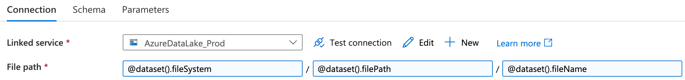
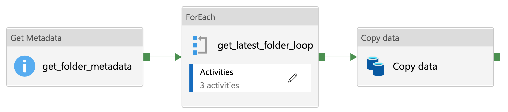
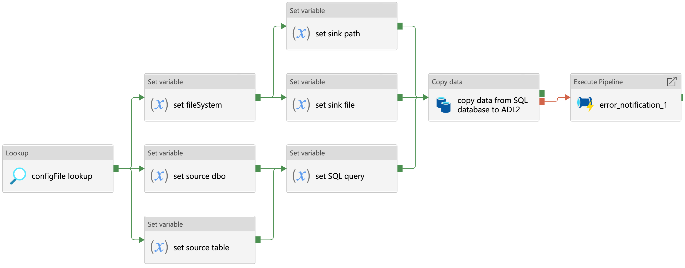
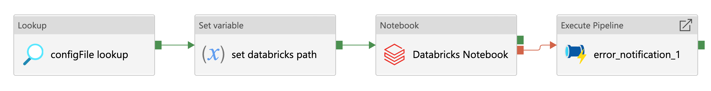
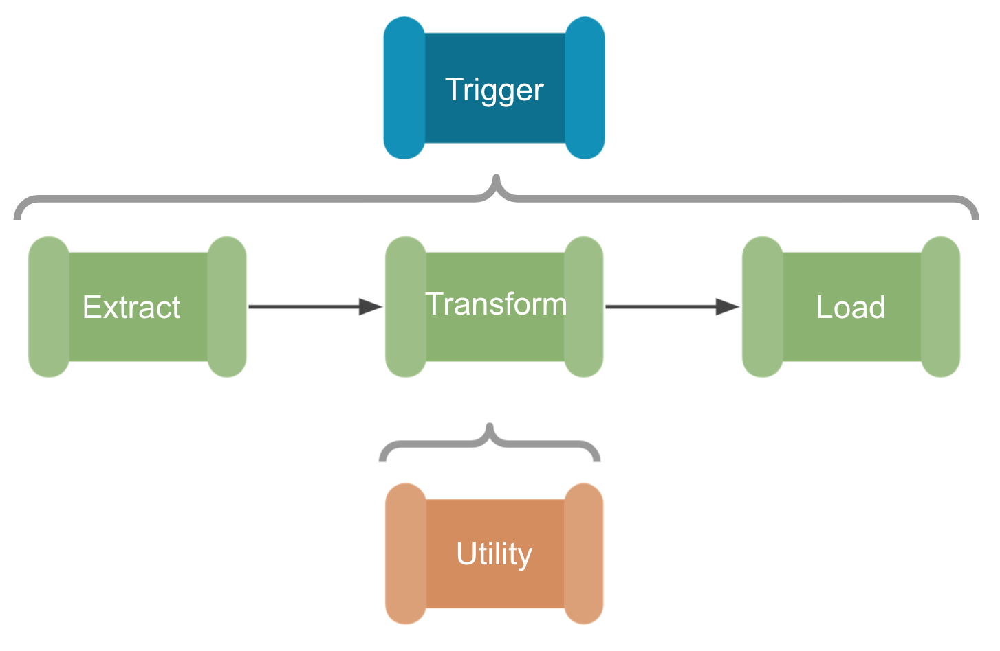

<h2> {{page.title}} </h2>

**Date:** September 2021\\
**Post author:** Craig Shenton - Data Engineer & Mattia Ficarelli - Data Analyst \\
**Research team:** NHSX Analytics Unit\\
**Git repository:** [NHSX Data Enginnering documentation site](https://nhsx.github.io/au-data-engineering/)

In this post, we aim to set out the data engineering principles we have developed over the last year, in designing and building our Azure cloud-analytics infrastructure. These principles are broken down into the following sections:

- [Parameterisation](#Parameterisation)
  - [Latest Folder Utility](#Example:-latestFolder)
- [Configuration-as-code](#Configuration-as-code)
- [Standardised ETL Design Patterns](#Standardised-ETL-Design-Patterns)
  - [SQL Database Ingestion Pipeline](#Example-1:-SQL-Database-Ingestion-Pipeline)
  - [Databricks Processing Pipeline](#Example-2:-Databricks-Processing-Pipeline)
- [Hierarchical Pipeline Orchestration](#Hierarchical-Pipeline-Orchestration)
- [Documentation-as-code](#Documentation-as-code)

## Parameterisation

In straightforward copy activities, hard coding each activity’s file paths is easy enough. In Azure Data Factory (ADF), this requires creating a new dataset object for each sink and for each source. Like many users, we initially created new datasets at every stage of our Extract, Transform, and Load (ETL) pipelines. However, once these processes started to scale in complexity to include iteration and conditionals, the sheer amount of datasets and variables that were required to run our pipelines became unmanageable.

The first step in untangling this web of configurations is applying parameterisation to your data pipelines. This adds a layer of abstraction to ADF that can dramatically reduce the amount of complexity needed to handle a multitude of ETL processes. Parameterisation transforms your activities into something akin to a function in python that accepts a certain set of variables and arguments. Much like in python, this abstraction allows you to use and re-use the parameterised dataset for all processes of the same type, reducing the need to create a new dataset for each process.

For example, we created a generic dataset for handling `.csv` files on our Azure Datalake that passes the following parameters at runtime:

  

<b>Figure 1.</b> An Azure Data Factory dataset file path configuration using the parameters; <code>@dataset().fileSystem</code>, <code>@dataset().filePath</code>, <code>@dataset().fileName</code> to denote the datalake file system name, the file path and and the file name.

 

From these parameters, that specify the file path and name and the file system of the Azure Datalake linked service, we can use any `.csv` file available as the source for any pipeline activity. This has reduced the number of datasets listed in our ADF environment dramatically, reducing the overhead required to organise, search, and maintain our pipelines.

A downside of highly parameterised pipelines is that they can become harder to debug due to the new level of abstraction. Now, in addition to the file paths the parameters may also be incorrectly configured. However, we find that the reduction in complexity and centralisation of pipeline configuration outweighs the initial growing pains of parameterisation.

### Example: latestFolder

  

<b>Figure 2.</b> An example Azure Data Factory pipeline utility that can append the source path of any file with the latest time-stamped folder path.

 

A practical example of the utility of parameterisation is the ability to append the source path of any file with a time-stamped folder, for example `@concat(variables('sourcePath'),variables('latestFolder'))`. This allows for a well organised record of data sampled at different time points to be stored within the Datalake.

A step-by-step walkthrough of this utility can be found on our [Data Engineering documentation site](https://nhsx.github.io/au-data-engineering/adfutilities.html#latest-folder-lookup) [[1](https://nhsx.github.io/au-data-engineering/adfutilities.html#latest-folder-lookup)].

## Configuration-as-code

Configuration-as-code is the practice of managing the configuration of software using plain text `.json` files stored within a git repository. [[2](https://www.perforce.com/blog/vcs/configuration-as-code)].

These ‘config’ files establish the parameters and settings for all of the datasets, linked services, and stored procedures required for a particular ETL pipeline. These files are called via ADF Lookup activities with values set as variables to give ADF everything it needs to know for a pipeline to run end-to-end. This approach means that in order to deploy a whole new data pipeline in ADF, only a new configuration file is required. Thus, in addition to making it easier and quicker to create a new ETL pipeline, maintaining configurations is also centralised, making configuration mismatches between activities easier to avoid, allowing for more consistent deployments.

Data Engineers often store their configurations in a database, alongside the data for convenience, however using structured `.json` files has additional advantages that should be considered:

- The first is that as plain text files, they can be saved in a git repository, thus putting them under version control. This gives you a level of traceability in terms of how-and-when changes were made and allows for your configurations to go through the same DevOps best practices and code review before they are deployed to production [[2](https://www.perforce.com/blog/vcs/configuration-as-code)].
- The second benefit is that keeping configuration-as-code separates out your pipeline and configuration deployments. Decoupling these processes allows you to release and/or roll-back changes separately, which is important for tracing and debugging errors. Critically, this allows you to rapidly determine if the returned error is due to a configuration issue or a pipeline coding issue [[3](https://www.cloudbees.com/blog/configuration-as-code-everything-need-know)].

## Standardised ETL Design Patterns

Templates help us avoid building the same workflows repeatedly, as once developed and thoroughly tested, they can be used in many different pipelines. There are a growing number of common ETL templates available in ADF that are a great resource to get you started, found on Microsoft's Azure documentation site [[4](https://docs.microsoft.com/en-us/azure/data-factory/solution-templates-introduction)].
However, these templates still need to be hand configured for your specific pipeline. Applying the parameterisation and configuration-as-code principles outlined above to our templates allows us to go much further. We have created a set of fully abstract and perameratised ETL workflows that only require a configuration file lookup to run. In essence, these templates become 'plug-and-play', and can be chained together very quickly. By focusing on just a handful of generic and reusable templates, more resources can be allocated to testing and maintaining these resources, knowing that they will be used over and over, by many members of the development team. This is a far more efficient use of development time, and allows us to be confident that new pipelines will run upon their first implementation without much issue. Like the other components in ADF, our template files are simply stored as a JSON file within our code repository, so they can be shared and improved upon by the wider data engineering community.

For our internal analytics data engineering work, we have found it useful to break the templates into the following categories:

- **Ingestion:** In the first instance we developed ingestion templates for every scenario, allowing us to rapidly ingest new datasets with minimal configuration. These typically involve HTTP requests, API calls, SQL stored procedures, and processes to copy files from SharePoint.
- **Processing:** Our analytical processing is largely done through databricks, so these pipelines configure the analytics notebook and start a new spark job cluster.
- **Staging:** Staging is where we push data to our Tableau SQL server, so we have templates to run multiple stored procedures and update metric tables for each of our analytical products.
- **Utilities:** Last but by no means least, these are smaller functions that can be called multiple times at any stage of an ETL pipeline. Most involve sending data back and forth to systems outside ADF and/or updating configuration files.

### **Example 1**: SQL Database Ingestion Pipeline

  

<b>Figure 3.</b> An example Azure Data Factory ingestion pipeline template that can be configured to extract data from an Azure SQL database to Azure Datalake blob storage.

 

The pipeline shown above is a fully parameterised template developed to ingest raw data from an Azure SQL database to Azure Datalake blob storage. This is an example of a 'Source-Sink' pattern--used for parameterising and configuring data copy activities that move data from one location to another. As mentioned in the parameterisation section, each Azure Data Factory copy activity requires at least two datasets to configure both source and sink locations. However, here we have created a generic SQL dataset and a generic Azure Datalake dataset that can be dynamically configured across all pipelines. As such, this template can be used and re-used to move data from any Azure SQL server to any Azure blob storage container.

The SQL ingestion template works as follows:

- The configuration file is called using a lookup activity and the resulting configuration values are saved as variables before executing the copy activity at runtime.
- For the source dataset, we require the parameters for connecting to an Azure SQL server.
- The server details and connection credentials are passed via an ADF linked service, which itself can be further parameterised.
- The configuration file then sets the source database owner (dbo) string, the source table name, and if required, a SQL query to filter the data before the copy activity is run.
- On the sink side, the Datalake connection string is also passed via an ADF linked service, but the file system, sink path, and file name are all set by the configuration file. This could be a .csv file or a .parquet file for example
- Finally, if the copy activity fails for some reason, an error notification pipeline is called that contains a simple logic app used to notify a specified email address of the error [[5](https://www.mssqltips.com/sqlservertip/5718/azure-data-factory-pipeline-email-notification-part-1/)]

You can download the Azure Data Factory `.json` configuration file on [our documentation site](https://nhsx.github.io/au-data-engineering/adfpipelines.html#sql-database-ingestion-pipeline) and use this template in your own data pipelines [[6](https://nhsx.github.io/au-data-engineering/adfpipelines.html#sql-database-ingestion-pipeline)].

### **Example 2**: Databricks Processing Pipeline

  

<b>Figure 4.</b> An example Azure Data Factory pipeline processing pipeline template that can be configured to run a Databricks notebook.

 

The parameterised pipeline template above has been developed to run a Databricks notebook from Azure Data Factory. This is an example of a 'Key-Value' pattern--useful for configuring the settings of activities outside of Azure Data Factory itself. Here the json configuration file is providing the key-value of a Databricks notebook file path. This could also be used to give the URL of an Azure logic app or pass multiple variables to an Azure function app for example.

The Databricks processing template works as follows:

- The configuration file is called using a lookup activity and the resulting configuration values are saved as variables before executing the copy activity at runtime.
- A Set variable activity reads the databricks notebook path and saves it as a Azure Data Factory variable.
- The Databricks notebook activity runs the specified Databricks notebook using an ephemeral job cluster (therefore no cluster ID is required).
- Finally, if the Databricks notebook activity fails, an error notification pipeline is called that contains a simple logic app used to notify a specified email address of the error.

We typically use this pipeline to trigger an orchestrator Databricks notebook which in turn runs a series of data processing notebooks. This allows for much more flexibility, as we may want to process multiple metric calculations from the same data source.

You can download the Azure Data Factory `.json` configuration file on [our documentation site](https://nhsx.github.io/au-data-engineering/adfpipelines.html#databricks-processing-pipeline) and use this template in your own data pipelines [[7](https://nhsx.github.io/au-data-engineering/adfpipelines.html#databricks-processing-pipeline)].

## Hierarchical Pipeline Orchestration

  

<b>Figure 5.</b> A hierarchicy of pipelines. At the top, a orchestration pipeline that triggers the sub-pipelines below. Each phase of the data processing (extract, transform, and load, or ETL) is a fully parameterised template that requires no setup of its own [<a href="https://github.com/mrpaulandrew/ContentCollateral">8</a>]. 

 

One of the most significant changes made to our data engineering setup is the use of hierarchical pipelines; that is the use of a single orchestration pipeline to trigger multiple ETL pipelines and utility sub-pipelines. This is based on Paul Andrews’ grandparent, parent, child design pattern that may be familiar to SSIS users [[9](https://mrpaulandrew.com/2019/09/25/azure-data-factory-pipeline-hierarchies-generation-control/)]. With this design, and the generic ETL templates outlined above, we can create a ‘plug-and-play’ data engineering system. We simply select the ingestion, transformation, and staging patterns required from the templates and link them together under the orchestration pipeline. A single json config file is then created with all the 'Sink-Source' and 'Key-Value' pairs needed to move the data through the ETL process, so no configuration is required in Azure Data Factory itself. This has significantly reduced the amount of time needed to set up new pipelines, and ensures best practices are maintained across all our products.

If we use the SQL ingestion and Databricks processing examples outlined above, we could very rapidly make a new ETL pipeline using the hierarchical system of pipeline development:

- First we would create an orchestration pipeline that would lookup the configuration file and attach any Azure Data Factory triggers that set when, and how often the pipeline would run.
- Next we can simply ‘plug-and-play’ with the ETL templates, first to ingest new data from a SQL server, then process that data with a Databricks notebook.
- Finally, the processed data could be staged, on a Tableau server for example, for BI developers to transform into visualisations and metrics.
- Within each ETL pipeline there would also be running pre-defined utility sub-pipelines, such as any testing and error handling processes, or our latestFolder example, which could be used to make sure we are processing the latest cut of the data before handing over to Databricks.

## Documentation-as-code

Documentation-as-code is the principle that either; documentation should be written with the same tools as your code, or that documentation should be automatically generated from your code [[10](https://technology.blog.gov.uk/2017/08/25/why-we-use-a-docs-as-code-approach-for-technical-documentation/)]. On a basic level this means that we manage our documentation via GitHub, following a Git workflow, and putting it under version control in the same way as our configuration files. In addition to the standard GitFlow best practices, we can also compare versions of both the product and the documentation, making it easier to see where one might be out of sync with the other. Like much of our work, we make the documentation repository open source to increase transparency and allow for others in the healthcare sector to implement our data engineering principles and best practice. Due to the structured nature of the .json format, our pipeline configuration files and the configuration files generated from ADF are readily transformed into tables and diagrams using python. As a result, we can automatically generate a great deal of our documentation and make sure it directly represents the live product.

## Would you like to know more?

To stay up to date about our work and find more Azure Data Factory templates,

- Please visit our documentation site: [https://nhsx.github.io/au-data-engineering/index.html](https://nhsx.github.io/au-data-engineering/index.html)
- Or view our list of GitHub repositories: [https://github.com/nhsx/au-data-engineering/blob/main/README.md](https://github.com/nhsx/au-data-engineering/blob/main/README.md).

## References

[1] NHSX (2021). Data Engineering Documentation Site: ADF Utilities - latestFolder [Online] [https://nhsx.github.io/au-data-engineering/adfutilities.html#latest-folder-lookup](https://nhsx.github.io/au-data-engineering/adfutilities.html#latest-folder-lookup)

[2] Perforce (2020). Configuration as Code: How to Streamline Your Pipeline. [Online] [https://www.perforce.com/blog/vcs/configuration-as-code](https://www.perforce.com/blog/vcs/configuration-as-code)

[3] Cloud Bees (2018). Configuration as Code: Everything You Need to Know. [Online] [https://www.cloudbees.com/blog/configuration-as-code-everything-need-know](https://www.cloudbees.com/blog/configuration-as-code-everything-need-know)

[4] Microsoft (2021). Azure Data Factory documentation site [Online] [https://docs.microsoft.com/en-us/azure/data-factory/solution-templates-introduction](https://docs.microsoft.com/en-us/azure/data-factory/solution-templates-introduction)

[5] MSSQL Tips (2019). Azure Data Factory Pipeline Email Notification. [Online] [https://www.mssqltips.com/sqlservertip/5718/azure-data-factory-pipeline-email-notification-part-1/](https://www.mssqltips.com/sqlservertip/5718/azure-data-factory-pipeline-email-notification-part-1/)

[6] NHSX (2021). Data Engineering Documentation Site: SQL Database Ingestion Pipeline [Online] [https://nhsx.github.io/au-data-engineering/adfpipelines.html#sql-database-ingestion-pipeline](https://nhsx.github.io/au-data-engineering/adfpipelines.html#sql-database-ingestion-pipeline)

[7] NHSX (2021). Data Engineering Documentation Site: Databricks Processing Pipeline [Online] [https://nhsx.github.io/au-data-engineering/adfpipelines.html#databricks-processing-pipeline](https://nhsx.github.io/au-data-engineering/adfpipelines.html#databricks-processing-pipeline)

[8] Paul Andrews (2019). The icons used for the hierarchical pipeline orchestration section of this post were designed by Paul Andrews. [Online] [https://github.com/mrpaulandrew/ContentCollateral](https://github.com/mrpaulandrew/ContentCollateral)

[9] Paul Andrews (2019). Azure Data Factory Pipeline Hierarchies (Generation Control) [Online] [https://mrpaulandrew.com/2019/09/25/azure-data-factory-pipeline-hierarchies-generation-control/](https://mrpaulandrew.com/2019/09/25/azure-data-factory-pipeline-hierarchies-generation-control/)]

[10] GOV.UK Technology in Government (2017). Why we use a 'docs as code' approach for technical documentation. [Online] [https://technology.blog.gov.uk/2017/08/25/why-we-use-a-docs-as-code-approach-for-technical-documentation/](https://technology.blog.gov.uk/2017/08/25/why-we-use-a-docs-as-code-approach-for-technical-documentation/)

Chris Ried 2018. Cover photo from Unsplash. [Online] [https://unsplash.com/s/photos/python?utm_source=unsplash&utm_medium=referral&utm_content=creditCopyText](https://unsplash.com/s/photos/python?utm_source=unsplash&utm_medium=referral&utm_content=creditCopyText)
